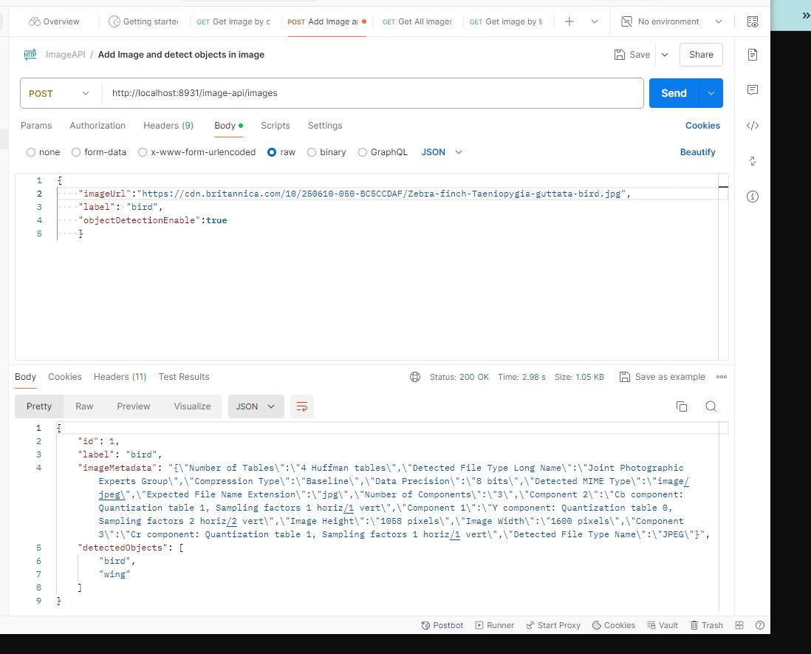

# ImageAPI

Please see the openapi spec yaml files for server side and client side endpoint documentation.

[imagaa.yaml](src%2Fapispec%2Fimagaa.yaml)

[openapi.yml](src%2Fapispec%2Fopenapi.yml)

Imagaa API is the thrid party API to detect objects.

## Overview

There are unit tests still needed for this project to be done. I was unable to finish by deadline, but I will keep adding them over the weekend to my private repo.
Also enhancements needed. 


## Structure

Generate `ImagesAPI` calls `ImagesController`
`ImagesController` calls `ImagesService`

Database access is in `ImageRepository`
Third party API call is defined in generated `ImagaaAPI`

Database script in database directory, I used MySQL


## API endpoint

Use Swagger to see the endpoint spec in a visual way
https://editor.swagger.io/

[imagaa.yaml](src%2Fapispec%2Fimagaa.yaml) is created for the third party api Imagaa client api spec 

[openapi.yml](src%2Fapispec%2Fopenapi.yml) is created for server side code

They are different styles for the query parameter in openapi
See https://swagger.io/docs/specification/serialization/#query

I choose this style for the object endpoint, this can be modified

```
http://localhost:8931/image-api/images/objects?item=banana,apple,candy
```

see example response from postman for add image endpoint


## Test

Test is just basic unit test for many possible scenarios

There is a `ApiControllerAdvice` class that we can catch exceptions and change it to desired error code.

## Note
I use the springboot version 2.7.8 is when I migrate to 3.3.0, the openapi generator is causing issue
```
error: package javax.validation does not exist
import javax.validation.Valid;
```
So for now I am using this version, the above issue can be a later fix